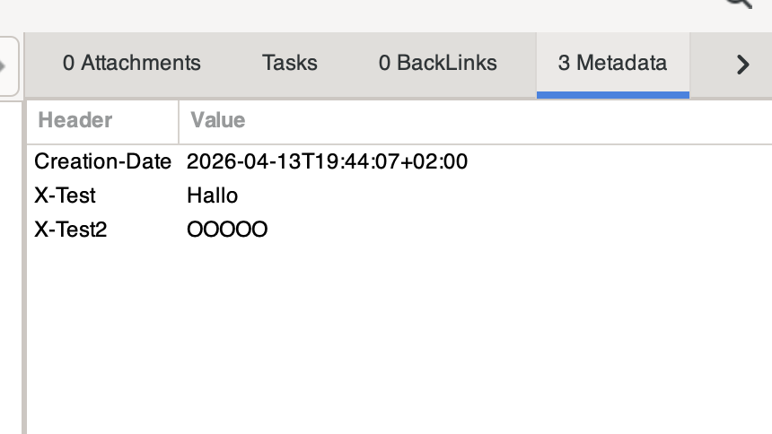

# Metadata Editor for Zim Wiki

A minimal metadata editor for Zim Wiki that allows
adding metadata headers to pages (similar to frontmatter
in Markdown).

## Installation

1. Clone the repository into your zim wiki plugin directory
    - Linux: `git clone https://github.com/j6s/zim-metadata-editor ~/.zim/plugins/`
    - macOS: `git clone https://github.com/j6s/zim-metadata-editor ~/Library/Application Support/org.zim-wiki.Zim/share/zim/plugins/metadata_editor` 
2. Restart Zim
3. Enable the plugin in the Zim settings
